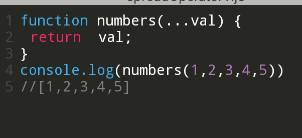

O0# JavaScript-Newbies-Podium-
This repository was intended to help junior javascript developer on basic javascript

<h3>REST OPERATOR</h3>

The rest operator (...) is a way to represent an indefinite number of arguments as an array in a function definition. It allows you to represent an indefinite number of arguments as an array, so that you can access them like an array in your function.

A rest is defined using three dots (...).
it signifies that the parameter is a placeholder to any argument passed to the function.

- Rest parameter stands for the rest of the parameters which is highly visible to the paramter list.
- A rest paramter is of <code>Array</code> type.
 
Let us see the an syntax.

   Example;
   

The above example uses rest operator to return anything that is passed to the function numbers as an argument.
how cool is that?

Here is an example of how you can use the rest operator in a function definition:

<code>
function sum(...num) {
  var result = 0;
  for(var i = 0; i < num.length; i++) {
    result += num;
  }
  return result;
}

console.log(sum(1, 2, 3, 4, 5)); // 15
</code>

 In this example, the sum function takes an indefinite number of arguments, which are represented as an array called numbers. The function then iterates over the numbers array and calculates the sum of all the numbers.

 Javascript has some special rules for rest parameters.
- There can be atmost one rest parameter in a function parameter list.
- The rest parameter contains only values that have not  been given explicit names.
- The rest operator must always be the last argument in the function definition. You cannot have any other arguments after the rest operator.
- The rest operator can only be used in function definitions. You cannot use it in function calls.
- The rest operator is often used in combination with the spread operator (...). The spread operator allows you to spread the elements of an array or iterable object into separate elements.

 It can be used in the following ways:
1. function calls:

<code>
const numberList = [1, 2, 3, 4, 5,6,7];
console.log(Math.max(...numberList));

// 7

</code>

 
2. array literals:

<code>
const fruits = ['apple', 'banana', 'orange'];
const moreFruits = ['mango', 'kiwi', ...fruits];
console.log(moreFruits); 

// ['mango', 'kiwi', 'apple', 'banana', 'orange']

</code>

3. object literals.

<code>
const person = {
  name: 'John',
  age: 30
};
const newPerson = {
  ...person,
  address: 'New York'
};
console.log(newPerson); 

// { name: 'John', age: 30, address: 'New York' }

</code>

 

Overall the rest parameter is one of the good new feature to the language. It makes a very powerful feature of receiving a variable number of arguments civil and sensible from both the syntax and the semantics point of view.

Thank you for reading. if you enjoyed, 
connect with me here:

<a href = 'https://twitter.com/@WaiswaBryans'>Twitter</a> 
<a href = 'https://github.com/@WaiswaJBryans'>Github</a>

<a href='https://codepen.io/Waisbryans'>codepen</a>
