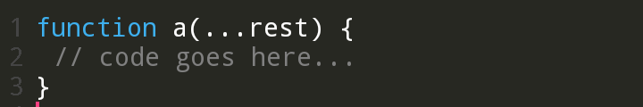
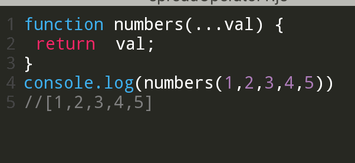

<h1>REST PARAMETER</h1>

A rest is defined using three dots (...).
it signifies that the parameter is a placeholder to any argument passed to the function.

- Rest parameter stands for the rest of the parameters which is highly visible to the paramter list.
- A rest paramter is of <code>Array</code> type.
 
Let us see the an syntax.

   Example;
   

The above example uses rest operator to return anything that is passed to the function numbers as an argument.
how cool is that?

Javascript has some special rules for rest parameters.
- The rest parameter has to be the last formal parameter.
- There can be atmost one rest parameter in a function parameter list.
- The rest parameter contains only values that have not  been given explicit names.

Overall the rest parameter is one of the good new feature to the language. It makes a very powerful feature of receiving a variable number of arguments civil and sensible from both the syntax and the semantics point of view.

Thank you for reading. if you enjoyed, 
connect with me here:

<a href = 'https://twitter.com/@WaiswaBryans'>Twitter</a> 
<a href = 'https://github.com/@WaiswaJBryans'>Github</a>
<a href='https://codepen.io/Waisbryans'>codepen</a>
